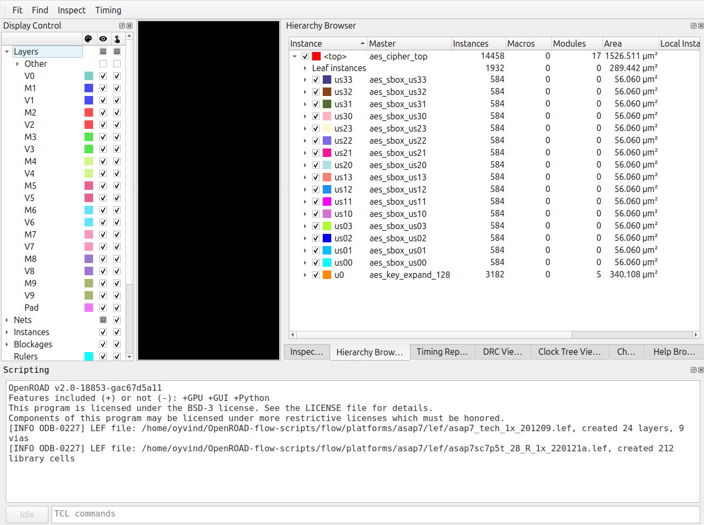
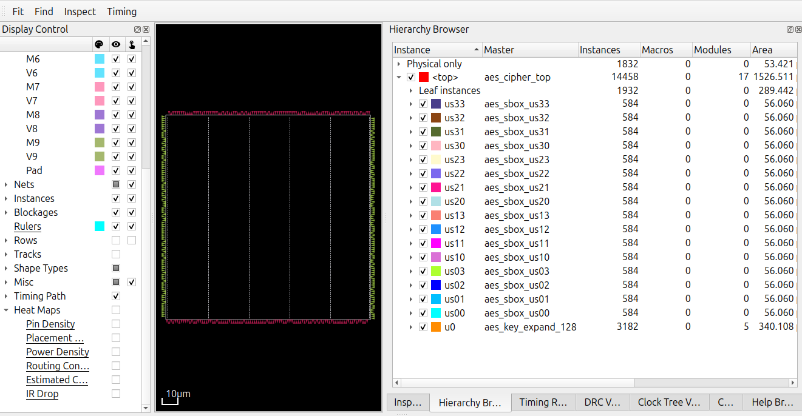
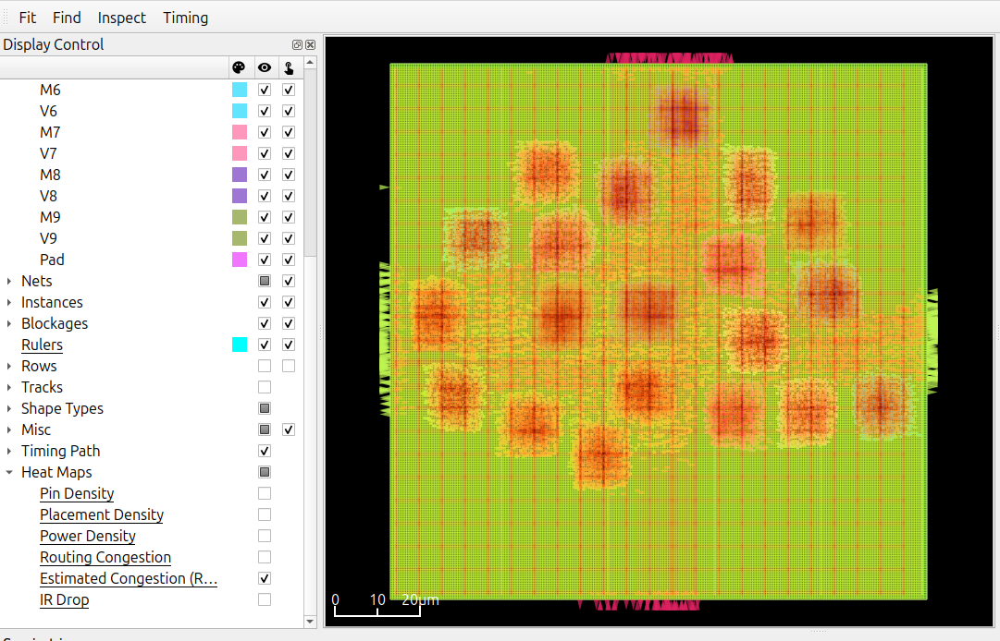
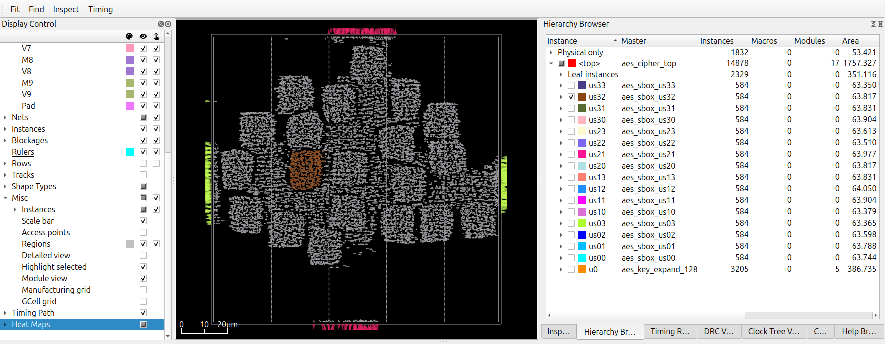
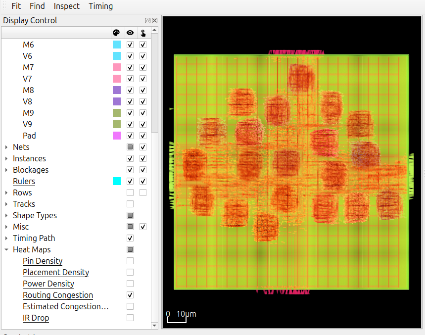

Report on a design prior to setting up a configuration
======================================================

This configuration allows running synthesis and floorplan
to extract some basic information useful when setting
up a config.mk file from scratch.

Below, instructions are given to run synthesis, floorplan, placement and
global route, then examine the results in the GUI to see what a
realistic floorplan and settings might be for your Verilog files.

The example below uses the designs/src/aes/*.v Verilog files, but
the Verilog files do not have to be located in the OpenROAD-flow-scripts
git repository, adjust the VERILOG_FILES argument to point to your Verilog
files:

    make DESIGN_CONFIG=designs/asap7/minimal/config.mk DESIGN_NAME=aes_cipher_top VERILOG_FILES="$(ls designs/src/aes/*.v | xargs)" clean_synth synth gui_synth

Where, the exploratory config.mk file to be replaced
by a design specific config.mk file is:

    DESIGN_CONFIG=designs/asap7/minimal/config.mk

Verilog files that to be investigated are specified by:

    VERILOG_FILES="$(ls designs/src/aes/*.v | xargs)"

The Verilog top module name is specified by:

    DESIGN_NAME=aes_cipher_top

Synthesis cleaned and re-run by:

    clean_synth synth
 
The GUI is opened by the makefile target:

    gui_synth

`make gui_synth` OpenROAD GUI information
-----------------------------------------

The module hierarchy can here be examined to give a sense of
area required for the default placement density.

`make gui_floorplan` OpenROAD GUI information
---------------------------------------------

Next to iterate on floorplan settings:

    make DESIGN_CONFIG=designs/asap7/minimal/config.mk DESIGN_NAME=aes_cipher_top VERILOG_FILES="$(ls designs/src/aes/*.v | xargs)" clean_floorplan floorplan gui_floorplan

A few more things can be learned from looking at this minimal floorplan:

- The pins are placed randomly on the edges and at least there
  is enough space on the edges to fit the top level pins
- Check that the floorplan size is not completely unreasonable and
  at least there is a chance that this design could go through
  placement with this density.

`make gui_place` OpenROAD GUI information
-----------------------------------------

Next to iterate on placement settings:

    make DESIGN_CONFIG=designs/asap7/minimal/config.mk DESIGN_NAME=aes_cipher_top VERILOG_FILES="$(ls designs/src/aes/*.v | xargs)" clean_place place gui_place

From placement more information about how to set up the config.mk
file can be learned:

- Examine estimated routing congestion to get a sense if there
  is a chance that the design can be routed.
- Get a sense of size and location of modules

CTS(Clock tree Synthesis)
-------------------------

After placement, CTS (clock tree synthesis is run). However the minimal design does
not have a clock, so CTS runs quickly, but does nothing.

`make gui_grt` OpenROAD GUI information
-----------------------------------------

For non-trivial designs, some more work will need to be done in floorplan and
placement before there is a chance that global routing will complete:

    make DESIGN_CONFIG=designs/asap7/minimal/config.mk DESIGN_NAME=aes_cipher_top VERILOG_FILES="$(ls designs/src/aes/*.v | xargs)" clean_place place gui_place

Global routing congestion heatmap can be examined in the GUI.

Next steps
----------

Start creating a config.mk file for your design, write an .sdc file to
examine timing and find reasonable values for the CORE_UTILIZATION
and PLACE_DENSITY for your design considering routing congestion.

Building from your own git repository
=====================================

ORFS, OpenROAD-flow-scripts, supports setting up a config.mk file
in your own git repository without the need to fork ORFS. It is
also possible to perform some preliminary builds of your Verilog
files to examine the results in the OpenROAD GUI.

To build from your own git repository:

    FLOW_HOME=~/OpenROAD-flow-scripts/flow make --file=~/OpenROAD-flow-scripts/flow/Makefile DESIGN_CONFIG=config.mk ...
